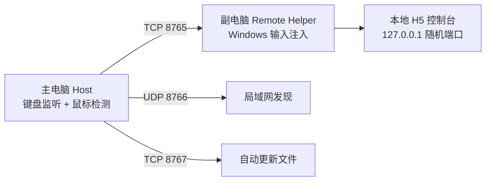

# Devices Router / Flow Keyboard Bridge

一个给 Logitech Flow 补键盘联动的小工具。

Logi Flow 继续负责鼠标跨屏，这个工具只负责把主电脑键盘转发到副电脑。目标是尽量“无脑”：主电脑打开 Host，副电脑打开 Remote，鼠标去哪边，键盘就跟去哪边。

## 当前能力

- Windows -> Windows 键盘转发
- 主电脑自动开放必要防火墙规则
- 副电脑自动发现主电脑
- 鼠标移动自动切换键盘目标
- 主电脑快捷键手动兜底
- 副电脑 H5 本地控制台
- 主电脑向副电脑提供局域网自动更新包

## 快速开始

### 主电脑

双击运行：

```text
FlowKeyboardHost.exe
```

保持窗口打开。主电脑会监听键盘、广播发现信息，并提供更新服务。

### 副电脑

双击运行：

```text
FlowKeyboardRemote.exe
```

新版本会自动打开一个本地网页控制台。连上主电脑后，在副电脑打开记事本、聊天框、IDE 等目标输入框即可接收键盘。

## 快捷键

- `Ctrl+Alt+1`：键盘回到主电脑
- `Ctrl+Alt+2`：键盘转到副电脑
- `Ctrl+Alt+Esc`：退出主电脑监听

## 工作方式



副电脑的 H5 页面只是控制台。真正把键盘输入写进 Windows 目标窗口的仍然是本地 helper，因为浏览器网页不能直接模拟系统级键盘输入到其他软件。

## 自动更新

主电脑启动后，会从 `updates/manifest.json` 提供更新信息。副电脑连接成功后会检查主电脑上的版本：

- 如果版本一致，只显示“已经是最新版本”。
- 如果版本不同，会下载并校验文件大小和 `sha256`。
- 校验通过后替换本地 exe。

当前 PyInstaller onefile 版本不会在更新后强制自动重启，避免 Windows 上出现 `_MEI...\python314.dll` 加载失败弹窗。更新完成后重新打开同一个 exe 即可。

## 从源码运行

```powershell
cd D:\development\随意开发\pc-tools\flow-keyboard-bridge
.\install.ps1
```

主电脑：

```powershell
.\run-server.ps1
```

副电脑：

```powershell
.\run-client.ps1
```

## 打包

```powershell
.\build-exe.ps1
```

生成文件：

- `dist\FlowKeyboardHost.exe`
- `dist\FlowKeyboardRemote.exe`
- `dist\flow-keyboard-server.exe`
- `dist\flow-keyboard-client.exe`
- `dist\updates\manifest.json`

## 测试

```powershell
.\.venv\Scripts\python -m pytest -q
```

## 已知限制

- UAC 弹窗、管理员权限窗口、部分游戏可能不接受普通模拟输入。
- 当前重点保证英文键盘和常用控制键稳定。
- 副电脑必须让目标输入框获得焦点。
- H5 客户端不是纯浏览器实现；网页负责显示和控制，键盘注入仍需要本地 helper。

## 开源状态

这是一个个人实用工具，优先解决“没买 Logi 键盘但想让 Flow 体验完整”的场景。代码和文档会继续围绕稳定性、无脑使用、自动更新和教程可读性迭代。

## Tauri/Rust 新版

新版桌面客户端位于：

```text
apps/desktop-tauri/
```

它会逐步替代 Python Host/Remote，目标是做成更接近 Clash Verge 的正式桌面软件。当前路线和验证边界见：

```text
docs/tauri-rust-roadmap.md
```
